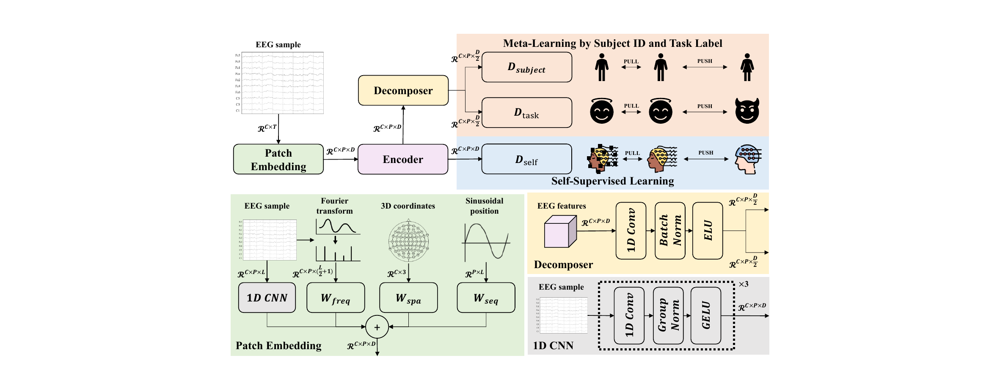

# STEM: Subject- and Task-Aware EEG Foundation Model

Official PyTorch implementation of **"Subject- and Task-Aware EEG Foundation Model"** (MICCAI 2026).

[]()
[]()
[]()
[](LICENSE)

> **Sion An**¹, **Soopil Kim**², and **Sang Hyun Park**¹ ³ ✉
>
> ¹ Graduate School of Artificial Intelligence, POSTECH, Pohang, Republic of Korea
> ² AX Research Group for Semiconductors, DGIST, Daegu, Republic of Korea
> ³ Department of Computer Science & Engineering, POSTECH, Pohang, Republic of Korea
>
> ✉ Corresponding author

---

## Overview

Recent EEG foundation models rely predominantly on self-supervised learning (SSL) to extract generalizable representations from large-scale datasets. This paradigm, however, overlooks the rich semantic information—such as **subject identities** and **task labels**—that is often available in pre-training datasets. As a result, it struggles to account for the inter-subject variability and task heterogeneity inherent in EEG signals, leading to suboptimal generalization to unseen subjects and adaptation to diverse tasks.

**STEM** (**S**ubject- and **T**ask-Aware **E**EG Foundation **M**odel) addresses this gap by actively leveraging available semantic information. It disentangles feature representations into **subject-aware** and **task-aware** components by integrating metric-based meta-learning with contrastive self-supervision, maximizing the utility of semantic labels to guide the learning of robust features.

<p align="center">
  
</p>

<p align="center"><i>
Overview of STEM. The model comprises a shared encoder, a decomposer, and three distinct decoders.
An EEG sample is first embedded with frequency, spatial, and sequential embeddings, then fed into the encoder.
The encoded features follow two pathways: (1) direct input to D<sub>self</sub> for self-supervised contrastive learning with an augmented view, and
(2) disentanglement via the decomposer into subject-aware and task-aware features, processed by D<sub>subject</sub> and D<sub>task</sub> for meta-learning.
</i></p>

## Key Contributions

- **Beyond SSL pre-training.** We propose an EEG foundation model that integrates a supervised metric-based meta-learning framework, fully leveraging semantic information (subject and task labels) available in large-scale EEG datasets to structure the latent space.
- **Feature disentanglement with meta-learning.** We explicitly separate subject- and task-aware representations, mitigating EEG variability so the model learns features that are both robust to individual neurophysiological differences and adaptable to new tasks.
- **Consistent improvements.** Through extensive experiments, we show that STEM yields consistent improvements across three downstream benchmarks, validating that explicitly modeling subject and task semantics is essential for general-purpose EEG foundation models.

## Method

STEM is trained in two phases:

**1. Pre-training.** A shared encoder is followed by a decomposer and three decoders, jointly optimized with a linear combination of three objectives:

- **Subject-aware meta-learning** (`L_sub`): a binary classification meta-task with an asymmetric sampling strategy, comparing a query against a positive prototype (same subject) and a single sample-level negative (different subject).
- **Task-aware meta-learning** (`L_task`): a 2-way *K*-shot metric-based objective using positive and negative support sets to form task prototypes.
- **Auxiliary self-supervised learning** (`L_self`): contrastive learning over a masked positive view to leverage abundant unlabeled (e.g., resting-state) EEG.

**2. Fine-tuning.** The pre-trained model is adapted to each downstream task. `D_self` is discarded, a classifier is appended to the output of `D_task`, and the model is fine-tuned end-to-end with `L_sub`, `L_task`, and a cross-entropy loss.

**Patch embedding.** Each EEG sample is segmented into non-overlapping temporal patches and embedded via a 3-layer 1D CNN, combined with three learnable embeddings—sequential (sinusoidal position), frequency (Fourier magnitude spectrum), and spatial (3D electrode coordinates).

## Installation

```bash
git clone https://github.com/SionAn/MICCAI2026STEM.git
cd MICCAI2026STEM

# (recommended) create a fresh environment
conda create -n stem python=3.9 -y
conda activate stem

pip install -r requirements.txt
```

<!-- TODO: confirm Python/PyTorch versions and add requirements.txt to the repo. -->

## Datasets

### Pre-training

STEM is pre-trained on **18 publicly available EEG datasets** spanning multiple tasks, including motor imagery, emotion recognition, seizure detection, and others. Please refer to the paper for the full list and corresponding references.

### Downstream

| Dataset | Task | Classes | Channels | Hz | Train / Val / Test |
|---|---|:---:|:---:|:---:|:---:|
| PhysioNet-MI | Motor imagery | 4 | 64 | 160 | 70 / 10 / 29 |
| SHU-MI | Motor imagery | 2 | 32 | 250 | 15 / 5 / 5 |
| ISRUC | Sleep staging | 5 | 6 | 200 | 80 / 10 / 10 |

**Preprocessing.** Signals are filtered with a 0.1–75 Hz bandpass and a 50/60 Hz notch filter, resampled to 200 Hz, segmented into 4-second windows (P = 20 patches, L = 40), channel-ordered by a standard MNE montage, and scaled to the range [-3, 3] µV. Dataset-specific preprocessing is described in the paper.

<!-- TODO: add a DATA.md or scripts describing how to download/organize each dataset. -->

## Usage

### Pre-training

```bash
python pretrain.py --config configs/pretrain.yaml
```

### Fine-tuning & Evaluation

```bash
python finetune.py --config configs/finetune.yaml --dataset physionet_mi
python evaluate.py  --config configs/finetune.yaml --dataset physionet_mi --ckpt <path/to/checkpoint>
```

<!-- TODO: replace the commands/flags above with the actual entry points in this repo. -->

### Key Hyperparameters

| Component | Setting |
|---|---|
| Encoder / Decoder | Transformer, 8 heads, 4 encoder layers, 2 decoder layers |
| Feature dimension | 256 |
| Support samples (*K*) | 3 |
| Decomposer | 1D conv (kernel size 3), patch-wise |
| SSL masking | 50% of patches randomly masked |
| Optimizer | AdamW |
| Pre-training | 3M iterations, cosine annealing (1e-4 → 1e-5), τ = 0.07, B = 8 |
| Fine-tuning | 50 epochs, 5-epoch linear warm-up → 5e-4, cosine annealing → 1e-6 |

## Results

### Task-related EEG analysis

| Method | Params (M) | PhysioNet-MI Acc | Kappa | F1 | SHU-MI Acc | AUCPR | AUROC |
|---|:---:|:---:|:---:|:---:|:---:|:---:|:---:|
| BIOT | 3.2 | 0.6153 | 0.4875 | 0.6158 | 0.6179 | 0.6770 | 0.6609 |
| LaBraM | 5.8 | 0.6173 | 0.4912 | 0.6177 | 0.6166 | 0.6761 | 0.6604 |
| CBraMod | 4.0 | 0.6225 | 0.4966 | 0.6224 | 0.6184 | 0.6745 | 0.6754 |
| CSBrain | 4.9 | 0.6117 | 0.4821 | 0.6111 | 0.6091 | 0.6720 | 0.6818 |
| **STEM** | **3.1** | **0.6242** | **0.4989** | **0.6232** | **0.6226** | 0.6753 | 0.6782 |

### State-related EEG analysis (ISRUC)

| Method | Params (M) | Acc | Kappa | F1 |
|---|:---:|:---:|:---:|:---:|
| BIOT | 3.2 | 0.7527 | 0.7192 | 0.7790 |
| LaBraM | 5.8 | 0.7633 | 0.7231 | 0.7810 |
| CBraMod | 4.0 | 0.7673 | 0.7368 | 0.7947 |
| CSBrain | 4.9 | 0.7633 | 0.7176 | 0.7792 |
| EEG-DINO | 201 | 0.7725 | 0.7441 | 0.8004 |
| **STEM** | **3.1** | **0.7863** | **0.7509** | **0.8036** |

STEM attains the best performance with the fewest parameters, and the performance gaps over the baselines are statistically significant (p < 0.05). For comparison methods reproduced in this work (CBraMod, CSBrain, EEG-DINO), we re-implemented them following their official codebases for a fair comparison.

## Citation

If you find this work useful, please consider citing:

```bibtex
@inproceedings{an2026stem,
  title     = {Subject- and Task-Aware EEG Foundation Model},
  author    = {An, Sion and Kim, Soopil and Park, Sang Hyun},
  booktitle = {Medical Image Computing and Computer-Assisted Intervention (MICCAI)},
  year      = {2026},
  publisher = {Springer}
}
```

<!-- TODO: update with the final proceedings pages/DOI once published. -->

## Acknowledgments

This study was supported by the Smart Health Care Program funded by the Korean National Police Agency (No. RS-2022-PT000186), the Institute of Information & Communications Technology Planning & Evaluation (IITP) grant funded by the Korea government (MSIT) (No. RS-2024-00439264), and the National Research Foundation of Korea (NRF) grant funded by the Korea government (MSIT) (No. RS-2025-00516124).

## License

This project is released under the MIT License. See [LICENSE](LICENSE) for details.
