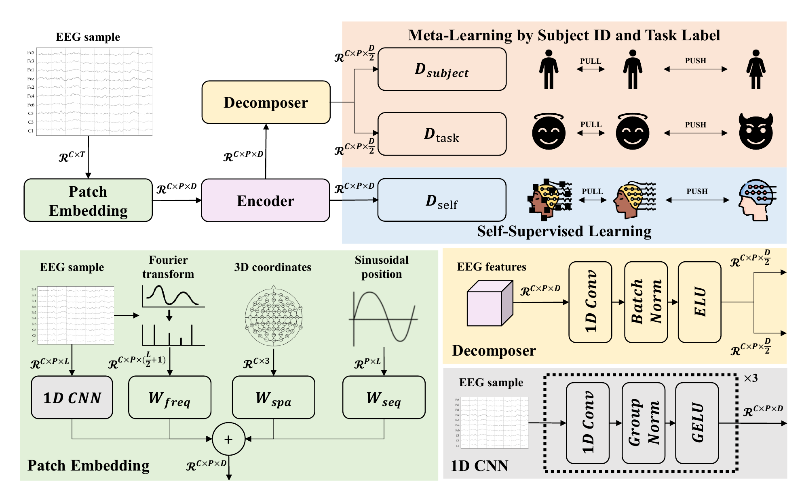

# STEM: Subject- and Task-Aware EEG Foundation Model

Official PyTorch implementation of **"Subject- and Task-Aware EEG Foundation Model"** (MICCAI 2026).

<p align="center">
  
</p>

## Repository Structure

```
├── model.py            # STEM (patch embedding, encoder, decomposer, D_self / D_task / D_subject)
├── layers.py           # criss-cross transformer layer
├── datasets.py         # pre-training episodes, downstream and few-shot datasets
├── pretrain.py         # pre-training (L_sub + L_task + L_self)
├── finetune.py         # fine-tuning (CE + L_sub + L_task) and evaluation on the test subjects
├── evaluate.py         # evaluation of a fine-tuned checkpoint
├── fewshot.py          # few-shot adaptation to unseen subjects
├── utils.py            # dataset lists, metrics, checkpoint loading
└── preprocessing/      # dataset-specific preprocessing scripts (see preprocessing/README.md)
```

## Installation

```bash
git clone https://github.com/SionAn/MICCAI2026STEM.git
cd MICCAI2026STEM

conda create -n stem python=3.10 -y
conda activate stem

# install PyTorch for your CUDA version first (https://pytorch.org), then
pip install -r requirements.txt
```

## Datasets

Signals are filtered with a 0.1–75 Hz bandpass and a 50/60 Hz notch filter, resampled to 200 Hz, segmented into 4-second windows (P = 20 patches, L = 40), channel-ordered by a standard MNE montage, and scaled to the range [-3, 3] µV.
All datasets are converted into a single processed root directory, which is passed to every script as `--data_dir`:

```
<data_dir>/<Name>/sorted_scaled/<subject>/<class>/<trial>.pkl   # {'X': (C, T), 'ch_names', 'ch_locations': (C, 3)}
```

See [`preprocessing/README.md`](preprocessing/README.md) for the full preprocessing pipeline.

## Pre-trained Weights

The pre-trained STEM weights will be released on Google Drive.

| Model | Params (M) | Download |
|---|:---:|:---:|
| STEM | 3.1 | Coming soon |

Download the file and place it at `checkpoints/stem_pretrained.pth` (or pass its path to `--pretrained`).

## Usage

All paths (data, checkpoints, outputs) are given as arguments. Run `python <script>.py --help` for all options.

### Pre-training

```bash
# single GPU
python pretrain.py --data_dir /path/to/processed --save_dir /path/to/output/pretrain

# multiple GPUs
torchrun --nproc_per_node=4 pretrain.py --data_dir /path/to/processed --save_dir /path/to/output/pretrain

# resume
python pretrain.py --data_dir /path/to/processed --save_dir /path/to/output/pretrain \
    --resume /path/to/output/pretrain/latest.pth
```

Model weights are saved as `stem_iter<N>.pth` every `--save_every` iterations, and `latest.pth` holds the full training state. By default all pre-training datasets in `PRETRAIN_DATASETS` (`utils.py`) are used; a subset can be selected with `--datasets`.

### Fine-tuning

```bash
for d in PhysioNet SHU ISRUC; do
    python finetune.py --data_dir /path/to/processed --dataset $d \
        --pretrained checkpoints/stem_pretrained.pth \
        --save_dir /path/to/output/finetune --seed 1111
done
```

The checkpoint with the best validation score (Cohen's kappa for PhysioNet-MI / ISRUC, AUCPR for SHU-MI) is evaluated on the test subjects. The model and the test metrics are saved as `stem_<dataset>.pth` and `stem_<dataset>_test.json` in `--save_dir`.

### Evaluation

```bash
python evaluate.py --data_dir /path/to/processed --dataset PhysioNet --ckpt /path/to/output/finetune/stem_PhysioNet.pth
```

### Few-shot adaptation

```bash
python fewshot.py --data_dir /path/to/processed --dataset PhysioNet --few 5 \
    --pretrained checkpoints/stem_pretrained.pth \
    --save_dir /path/to/output/fewshot
```

The model is fine-tuned on the training subjects with `L_task` and `L_sub`. Each test query is then classified by cosine similarity to prototypes built from `--few` (*K′*) labeled trials of the same unseen subject, after `--adapt_steps` adaptation steps on that support set.

## Citation

If you find this work useful, please consider citing:

```bibtex
@inproceedings{an2026stem,
  title     = {Subject- and Task-Aware EEG Foundation Model},
  author    = {An, Sion and Kim, Soopil and Park, Sang Hyun},
  booktitle = {Medical Image Computing and Computer-Assisted Intervention (MICCAI)},
  year      = {2026},
  publisher = {Springer}
}
```

## License

This project is released under the MIT License. See [LICENSE](LICENSE) for details.
